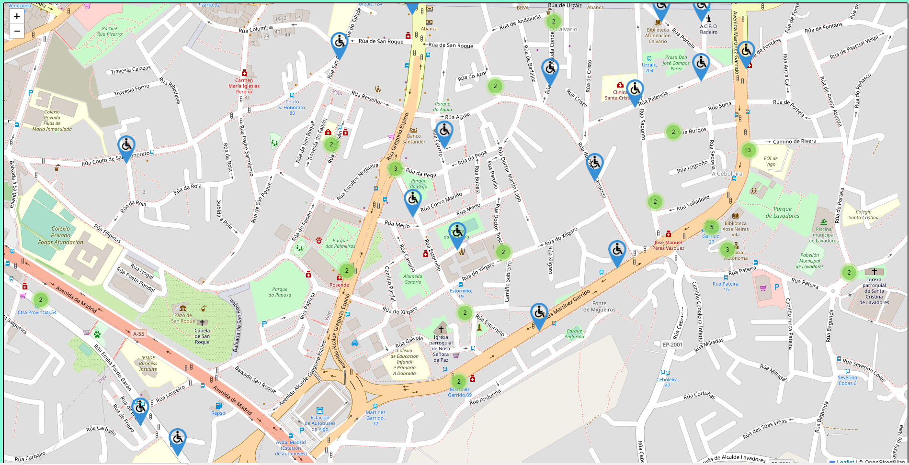

# Disable parking slot map prototype


SImple project to display markers of disable parking slot in a map (dummy data gathered from https://datos.vigo.org/data/trafico/plazas_minusvalido.json)

This project has been created using **webpack-cli**, you can now run

```
npm run build
```
to bundle your application

To run the app open the index.html from the dist folder in a web browser


